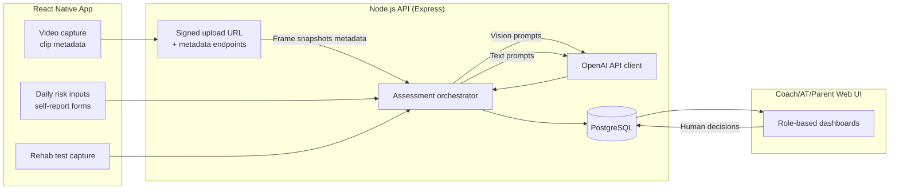

# Movement Safety Platform Architecture

## Overview

The platform combines on-field movement assessment, individualized risk insights, and return-to-sport readiness checks across four coordinated services:

1. **On-field Movement Safety Coach** – captures motion clips, samples frames, and queries OpenAI vision models for qualitative risk cues.
2. **Risk Twin** – ingests daily workload and context data to classify injury risk and recommend a single actionable intervention.
3. **Rehab Co-Pilot** – verifies limb symmetry and control metrics during recovery, gating return-to-play decisions.
4. **Coach / AT / Parent Portal** – surfaces AI outputs in role-specific language and context.

All services share a common backend built with Node.js/TypeScript (Express + Prisma), a PostgreSQL database, and a React Native client application (Expo-managed workflow) that serves athlete-facing functions. A companion web dashboard for staff roles can be layered on the same React codebase using Expo Router's web support or a standalone React web app.

## Data Flow Summary

## Backend Modules

| Module | Responsibilities |
| --- | --- |
| `auth` | JWT-based authentication with role scopes (`athlete`, `coach`, `at_pt`, `parent`, `admin`). |
| `media` | Temporary storage ticketing and frame extraction jobs. Uses S3-compatible object storage (e.g., AWS S3, Supabase storage) and FFmpeg Lambda for frame sampling. |
| `assessments` | Orchestrates OpenAI requests for movement analysis, risk classification, and rehab clearance. Normalizes prompts and parses structured responses. |
| `interventions` | Stores recommended interventions, tracks acknowledgement/completion, and supports OpenAI-driven rephrasing per audience. |
| `reports` | Generates PDF/HTML summaries for rehab clearance and daily risk rollups. |
| `notifications` | Push notifications via Expo/FCM and email via transactional provider. |

### OpenAI Strategy

- **Vision analysis**: Use GPT-4o or GPT-5 (when available) with a prompt template that includes context (athlete profile, test type, environmental conditions) and sampled frame images. Parse numeric scores and qualitative cues.
- **Risk reasoning**: Feed structured JSON of daily exposures and known risk modifiers. Prompt the model to classify discrete risk levels (`green`, `yellow`, `red`) and propose exactly one intervention.
- **Language tailoring**: Provide the same underlying assessment and ask for rewrites targeted at `coach`, `parent`, `athlete`.

### Data Persistence

- `athletes` – demographics, sport, injury history, contact links.
- `sessions` – a movement assessment occurrence, referencing captured media and OpenAI results.
- `risk_snapshots` – daily risk classification inputs & outputs.
- `rehab_tests` – raw metrics, symmetry calculations, clearance decisions.
- `recommendations` – interventions tied to athletes and sessions.
- `users` – login identities with role-based access control.
- `audit_logs` – trace OpenAI prompt/response metadata for compliance.

## Mobile App Overview

- **Authentication**: Email/OTP or SSO; stores JWT in secure storage; uses Expo Router for navigation.
- **Movement Capture**: React Native Vision Camera to record short clips. Client samples frames locally (via `expo-video-thumbnails` or native module) before uploading.
- **Daily Risk Form**: Multi-step form collects exposures, soreness, sleep, etc., and posts JSON to `/risk`.
- **Rehab Module**: Guided tests with instructions, countdown timers, and prompts to upload hop videos/strength metrics.
- **Live Feedback**: Receives backend push notification or websocket updates with cues; optional on-device TTS via `expo-speech`.

## Portal

- Use a shared design system through React Native for Web or standalone MUI React app.
- Displays team-level heatmap, athlete drill modifications, rehab progress, audit trail.
- Supports export of rehab clearance PDFs and daily risk CSVs.

## Compliance & Safety Considerations

- Store prompts/responses with minimal PHI; use athlete IDs rather than names where possible.
- Log OpenAI response confidence and include manual override workflows.
- Provide disclaimers that AI guidance complements, not replaces, licensed medical oversight.
- Implement monitoring for outlier responses and fallback rules (e.g., if model output malformed, mark review required).

## Next Steps

1. Scaffold backend (Express + Prisma) with auth, athlete, and assessment routes.
2. Integrate OpenAI SDK and create prompt templates with strict JSON schema validation.
3. Scaffold React Native app using Expo, implementing auth flow and Movement Coach prototype.
4. Stand up Postgres (local Docker + Prisma migrations) and configure object storage (S3/Supabase).
5. Build portal views for coaches and clinicians, iterating on UX with target users.
